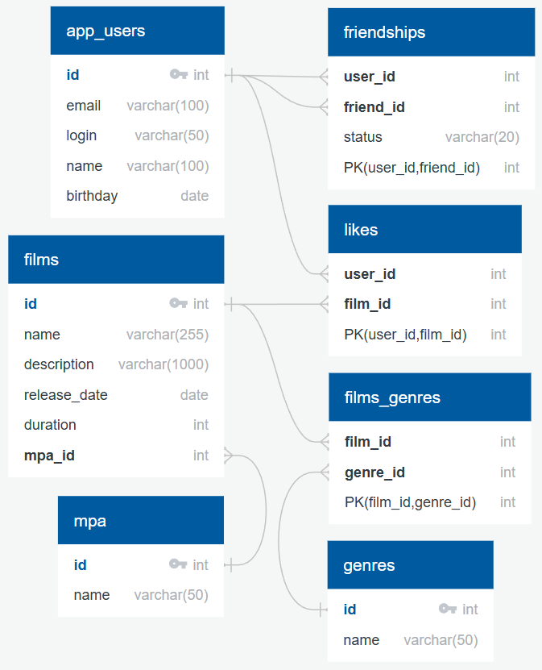

# Filmorate

Схема базы данных приложения Filmorate:

---

## Пояснение к схеме

- **app_users** — хранит всех пользователей с их данными: email, login, name и birthday.
- **films** — хранит фильмы с name (название), description (описание), release_date (дата релиза),
duration (длительность) и mpa_id (ссылка на рейтинг).
- **genres** — справочник жанров (Комедия, Драма, Триллер, Ужасы, Фантастика, Боевик, Мелодрама,
Анимация, Приключения, Документальный).
- **mpa** — справочник рейтингов (0+, 6+, 12+, 16+, 18+).
- **films_genres** — связь many-to-many между фильмами и жанрами (film_id, genre_id).
- **likes** — связь many-to-many между пользователями и фильмами (лайки) (user_id, film_id).
- **friendships** — связь many-to-many между пользователями,
хранит status дружбы (друзья / не друзья) (user_id, friend_id).

Составные ключи в таблицах many-to-many обеспечивают уникальность каждой пары записей.

---

### Примеры SQL-запросов

-- 1. Получить все фильмы
SELECT * FROM films;

-- 2. Топ-5 популярных фильмов по количеству лайков
SELECT f.id, f.name, COUNT(l.user_id) AS likes_count
FROM films f
LEFT JOIN likes l ON f.id = l.film_id
GROUP BY f.id, f.name
ORDER BY likes_count DESC
LIMIT 5;

-- 3. Получить друзей пользователя с id = 1 (подтверждённые)
SELECT a.*
FROM app_users a
JOIN friendships f ON a.id = f.friend_id
WHERE f.user_id = 1 AND f.status = 'друзья';

-- 4. Получить фильмы жанра "Драма"
SELECT f.*
FROM films f
JOIN films_genres fg ON f.id = fg.film_id
JOIN genres g ON fg.genre_id = g.id
WHERE g.name = 'Драма';

-- 5. Добавить новый фильм
INSERT INTO films (name, description, release_date, duration, mpa_id) VALUES
('Interstellar', 'Космическое путешествие', '2014-11-07', 169, 3);

-- 6. Пользователь ставит лайк фильму
INSERT INTO likes (user_id, film_id) VALUES
(1, 4); -- Пользователь с id=1 лайкнул фильм с id=4

-- 7. Добавить новую дружбу (неподтверждённую)
INSERT INTO friendships (user_id, friend_id, status) VALUES
(1, 3, 'не друзья');

-- 8. Подтвердить дружбу
UPDATE friendships
SET status = 'друзья'
WHERE user_id = 1 AND friend_id = 3;

-- 9. Получить всех пользователей, которые лайкнули фильм с id = 2
SELECT u.*
FROM app_users u
JOIN likes l ON u.id = l.user_id
WHERE l.film_id = 2;

-- 10. Получить все жанры фильма с id = 1
SELECT g.*
FROM genres g
JOIN films_genres fg ON g.id = fg.genre_id
WHERE fg.film_id = 1;